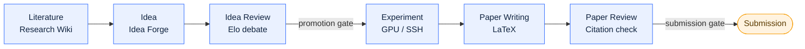

<p align="center">
  
</p>

<p align="center">
  <strong>Autonomous, end-to-end AI research: from literature to a reviewed paper.</strong><br>
  Powered by a long-running agent core that plans, executes, and self-verifies its own work, turning every task into a resumable, auditable, human-gated run.
</p>

<p align="center">
  
  <a href="http://101.37.174.109:8080"></a>
  <a href="https://github.com/ZJU-REAL/Polaris/releases/latest"></a>
  <a href="LICENSE"></a>
  
  <a href="docs/assets/wechat-group-qr.jpg"></a>
</p>

<p align="center">
  <strong>English</strong> · <a href="README.zh-CN.md">简体中文</a>
</p>

<p align="center">
  
</p>

---

Polaris runs the entire research lifecycle as a single web application: literature survey, idea
generation, idea review, experiment building on real GPU servers, LaTeX paper writing, and paper
review. It is built for a research lab, with multi-user access, RBAC, and invite-code registration, and
it treats every long task as a **Voyage**: a persisted, resumable, human-gated agent run that can span
hours or days without losing state.

> [!NOTE]
> Polaris is not a chatbot wrapper. The heavy lifting (crawling, parsing, deduplication, metric parsing,
> citation matching) is deterministic code. LLMs are reserved for the judgement calls: scoring,
> synthesis, drafting, and review. This split keeps runs cheap, reproducible, and auditable.

## Demo

A 2-minute tour of the platform: the six-stage pipeline, the Voyage agent core, a real experiment
run, and PolarisBuddy.

https://github.com/user-attachments/assets/388972c1-7ffa-45f2-94c4-07f388379ba2

### Try it live

A guest account on a running instance, for looking around: sign in at
<http://101.37.174.109:8080> with the username `guest` and the password `zjuguest123`.

**The account is for demonstration only: it is read-only and cannot call any model.** It reaches every
screen, the admin views included, but nothing it does changes state — creating, editing, deleting and
uploading are all refused, and no LLM call will run, whether from chat, compilation or the assistant.
Lab members' details and the registration codes are hidden from it as well. It is there to show what
the platform looks like, not to do work on it.

## The research pipeline

Polaris models research as six stages. Each stage produces durable artifacts that the next stage
consumes, and every hand-off can pause at a human approval gate.



| Stage | What Polaris actually does |
| --- | --- |
| **Literature** | The Research Wiki ingests papers from OpenAlex, Semantic Scholar, and arXiv. Cold start snowballs citations from anchor papers and scores relevance against the **direction library's** inclusion config — statement, goals, scope and exclusions, written through a structured AI interview — then extracts full text (PyMuPDF) and compiles a cross-linked wiki page (TL;DR, method, reusable ideas, concept backlinks). There is **one wiki per paper, shared platform-wide**: the compile prompt carries no library statement or rubric, so the same paper never reads differently depending on where you opened it, and a concept is promoted only once two papers cite it. New arXiv work arrives through the daily feed, the single entry point libraries sync from; incremental sync with watermark resume, pgvector semantic search, research digests, and Obsidian vault sync. |
| **Idea** | Idea Forge runs multi-signal gap analysis over the knowledge base (concept co-occurrence holes, extracted paper limitations, trend velocity, survey gaps) to drive retrieval-planned idea generation. Ideas are scored on four axes (novelty, feasibility, operability, impact), deduplicated semantically, and funneled to a candidate pool. A deep Research Proposal builder then hardens the winner with a plan-execute-verify loop. |
| **Idea Review** | Configurable-persona reviewer agents debate pairwise; a judge produces an Elo tournament ranking. Lab members join the discussion live over WebSocket, and their comments enter the agent context as first-class input. |
| **Experiment** | The Experiment Lab uses per-user, Fernet-encrypted SSH credentials to reach the lab's GPU servers. An experiment Voyage asks intake questions first, plans the study, passes a compute-budget check, writes code, runs a smoke test, launches runs with streamed logs and live metric curves, then auto-iterates: parse metrics, reflect, then improve, debug, or stop — repairing failures under a **time** budget rather than a fixed retry count. It keeps a file-based memory it reads and writes across steps, and when it is genuinely stuck it **asks the user** instead of failing. A console gives each run a task map and a terminal you can talk to mid-stream. Figures are generated and VLM-checked. |
| **Paper Writing** | The Paper Writer opens a multi-file LaTeX project (NeurIPS, ICLR, ACL templates) with a CodeMirror 6 editor, real-time collaborative editing (CRDT), and server-side tectonic compilation to a live PDF preview. An agent drafts section by section, but experiment numbers may only come from real `ExperimentRun` metrics and citations must map to real knowledge-base entries. One click refreshes the references and wires the bibliography into the main TeX file. |
| **Paper Review** | Line-by-line citation verification (existence: exact, minor, or fabricated; support: supported, partial, or unsupported) plus deterministic fact-checking of every number against the experiment record, then multi-perspective top-venue reviewer agents and a meta-review. A fabricated citation forces a non-pass. |

## The Voyage agent core

Research tasks are long-running by nature: a cold-start literature backfill takes hours, an experiment
runs for days. Polaris's central abstraction is that every complex task is a Voyage: a resumable,
auditable run driven by a persisted three-part loop.

| Component | Role |
| --- | --- |
| **Navigator** | Planning. Decomposes a goal into a step plan with sub-goals, dependencies, and budget. In loop mode it edits the plan incrementally as evidence arrives, rather than replanning from scratch. |
| **Helm** | Execution. Runs a single step (LLM calls, tool calls, SSH remote ops, literature-API queries) and returns an observation. |
| **Sextant** | Self-verification. Checks each step against structured acceptance criteria (exit code, artifact exists, schema valid, metric threshold, count, LLM rubric). Deterministic checks run first; failures feed diagnostics back to Navigator, and repeated failure escalates to a human gate. |

> [!IMPORTANT]
> A Voyage is backed by a persistent state machine (`planning -> executing -> verifying -> ...`). If a
> worker crashes mid-run, the Voyage resumes from its last checkpoint after a health check. Budgets are
> attached to the run and auto-pause it when exceeded; every plan, action, and verdict is retained and
> replayable in the UI.

Not every task needs the full cognitive loop. A shared **Runtime** shell (state machine, checkpointing,
gates, budget, cancellation, event streaming) serves all task kinds, while the **Brain** (the full
plan-execute-verify loop) activates only for open-ended kinds such as experiments. Predictable pipelines
(wiki compile, idea review, paper drafting) run on fixed templates instead of being over-orchestrated.

## Key features

- **Research Wiki, "compile, don't retrieve."** LLMs read papers and compile a persistent, cross-linked
  knowledge base up front, instead of doing on-demand RAG at query time. One wiki per paper, shared
  platform-wide. Research digests, and Obsidian vault sync with `[[wikilinks]]` and frontmatter.
- **One content pool, four collections.** Every paper is stored exactly once; direction libraries,
  topic shelves, personal libraries, and the daily feed are membership layers over that pool. Libraries
  are decoupled from topics (many-to-many), own their own inclusion config, and come with governance:
  curators, monthly budgets, duplicate merge, user-created libraries under admin approval, and a
  recycle bin that stays out of search.
- **Daily arXiv feed.** A lab-wide feed of each day's new papers, with likes and one-click collection
  into any library you can write to. It is also the single arXiv entry point: libraries sync from the
  pool instead of querying arXiv themselves, on an admin-configurable schedule.
- **Idea Forge.** Signal-driven gap analysis, four-axis scoring, semantic dedup, and a deep
  Research-Proposal builder with novelty double-checking against the library and external sources.
- **Multi-agent and human review.** Persona reviewer agents debate to an Elo ranking; humans join live
  and are injected into the agent context, not bolted on afterward.
- **Experiment Lab over SSH.** Agents write and run code on real GPU servers, iterate on metrics, and
  collect logs and figures, under gated remote writes, command allow/deny lists, full audit, and triple
  budget caps (total, per-run, concurrency). A run keeps a file-based memory across steps, repairs
  itself under a time budget, and pauses to **ask you a question** rather than dying; its console shows
  a task map and a terminal you can talk to while it runs.
- **Paper Writer.** Online multi-file LaTeX with collaborative CRDT editing and server-side tectonic
  compilation; agent drafting bound to real metrics and real citations, plus one-click reference
  refresh wired into the main TeX file.
- **Paper Review with citation verification.** Existence and support are checked per citation against the
  library, Semantic Scholar, and OpenAlex; numbers are fact-checked against the experiment record.
- **PolarisBuddy, an in-app assistant.** A global companion that rides along on every page: a Claude
  Code-style multi-turn tool loop (streamed over SSE, with tool cards and inline figures) over the same
  read-only tool layer, in `chat`, `plan` (research-only, propose before acting), and `goal` (loop toward
  an objective) modes. It runs the same Navigator / Helm / Sextant split as a Voyage, so its steps are
  verified rather than merely produced, and it can hand work to subagents. Its greeting is stitched from
  real SQL counts rather than the model, it searches every library you can see, and it carries page
  context and persistent per-user memory. It is off unless the account may call a model.
- **Skills, in two layers.** Agent behavior is packaged as data, not code. *Voyage skills* are
  versionable, composable `guidance`, `rubric`, `persona`, and `workflow` packs injected at named points
  into agent prompts, enabled globally, with a publish-approve-install-rate marketplace; each Voyage
  snapshots the skills it used for reproducibility. *Agent skills* take the SKILL.md shape with
  three-level progressive disclosure — a one-line description in the catalog, the body fetched by
  `skill_load` as a tool result, attachments read on demand — so the model decides what to load and the
  prompt prefix stays cacheable.
- **MCP tool layer.** A single registry of read-only tools (literature, knowledge, project state,
  manuscripts, external search) is exposed both internally to the agent loop and externally as an
  **MCP server** (Streamable HTTP and stdio) for Claude Code, Codex, and Cursor, with a self-check and
  try-it playground. Project-isolated and strictly read-only.
- **Real-time everywhere.** SSE for agent streaming and Voyage progress; WebSocket for review
  discussions, approval notifications, experiment log tracking, and collaborative editing.
- **Multi-user and RBAC.** JWT auth (fastapi-users), invite-code registration, role-based access, and
  per-call token/cost accounting attributed to user, project, and voyage. Library and paper views are
  counted into a 7-day heat list, so the lab can see what people are actually reading.
- **LLM abstraction and model routing.** All model calls go through one layer; a DB-backed routing table
  maps each research stage to a provider, a model, and a reasoning-effort level (cheap models for
  scoring, strong models for debate and drafting). Admins set the global routes and users may override
  their own. The built-in fake provider is structurally disabled in production — setting the flag by
  mistake cannot turn it on.

## Tech stack

| Layer | Technology |
| --- | --- |
| Frontend | React 18 + TypeScript 5 + Vite 5, TanStack Query for all server state, CodeMirror 6, Yjs (CRDT), react-pdf, KaTeX |
| Desktop | Electron shell (macOS / Windows / Linux) that reuses the web bundle over an `app://` protocol; all heavy state stays on the remote server |
| Backend | FastAPI (fully async) + SQLAlchemy 2 + Alembic + fastapi-users (JWT) |
| Task queue | ARQ (Redis broker); every long task runs off the request thread |
| Data | PostgreSQL 16 with pgvector (embedding spaces isolated per model, so vectors never mix) + Redis 7 |
| Remote execution | asyncssh to GPU servers; SSH keys encrypted at rest with Fernet |
| LaTeX | tectonic, server-side, with a cached macro volume |
| LLM | Multi-provider abstraction (OpenAI-compatible and Anthropic) with a DB model-routing table |
| Deployment | Docker Compose (postgres, redis, api, worker, frontend) |

## Desktop client

Polaris ships as a desktop app for macOS, Windows, and Linux. **Download the installer from
[Releases](https://github.com/ZJU-REAL/Polaris/releases/latest)** — `.dmg` / `.zip` (macOS, universal),
`.exe` / portable `.zip` (Windows), `.AppImage` / `.deb` (Linux), built by CI on every `v*` tag. The
app checks for updates and applies them without a restart where it can.

The builds are **neither signed nor notarized**, so each platform needs to be told once that the app is
safe to run: on macOS `xattr -dr com.apple.quarantine /Applications/Polaris.app` (or right-click →
Open); on Windows choose More info → Run anyway past SmartScreen; on Linux the AppImage needs
`libnss3 libgtk-3-0 libasound2`, and `--no-sandbox` under Ubuntu 24.04+ AppArmor. On first run the app
asks for your lab's Polaris server address and validates it against `/api/health`; the server must
whitelist the desktop origin, since the page is served from `app://polaris` and every request is
cross-origin.

The Electron shell (`src/desktop/`) is a shell plus a small local process, not an offline build:
Postgres, Redis, the worker, and all LLM calls stay on the remote server, and the renderer talks to it
directly. To build it yourself:

```bash
make desktop-deps           # install the shell's dependencies (once)
make desktop-dev            # build the frontend and run the shell (app:// protocol)
make desktop-dist           # package an unsigned installer for the current platform
```

See [docs/desktop.md](docs/desktop.md) for the process model, the IPC contract, and packaging notes.

## Quick start

For a personal instance using a Codex subscription instead of an LLM API key, see [Codex deployment (中文)](docs/zh/codex-deployment.md). Embeddings and reranking keep their own API providers.


> [!TIP]
> Docker Compose is the recommended way to run Polaris, in development and in production. It needs only
> Docker and Docker Compose installed, with no local Python, Node, or database. See
> [docs/deployment.md](docs/deployment.md) for production deployment.

```bash
cp .env.example .env        # set provider keys and secrets
make dev                    # full stack via docker compose, hot reload
```

- Frontend: <http://localhost:5173>
- Backend API docs: <http://localhost:8000/docs>

Local development without Docker (falls back to SQLite):

```bash
make backend-dev            # venv + uvicorn on :8000
make frontend-dev           # npm install + vite dev on :5173
```

Common tasks:

```bash
make migrate                # alembic upgrade head
make test                   # backend pytest + frontend build
make lint                   # ruff check + tsc --noEmit
```

## Docker deployment

Deploy from pre-built images on Docker Hub (`tricktreat/polaris-{api,worker,frontend}`, published by
CI on every `v*` tag) — no local build needed:

```bash
cp .env.example .env        # set POLARIS_ENV=prod, POLARIS_IMAGE_TAG, secrets, and an LLM key
docker compose --env-file .env -f docker/docker-compose.yml pull
docker compose --env-file .env -f docker/docker-compose.yml up -d
docker compose -f docker/docker-compose.yml exec api alembic upgrade head   # required on first run
```

The frontend is served at `http://<host>:8080`. The `worker` container is required (it runs all long
tasks), and the first-run migration is mandatory (Postgres tables are not auto-created). Pass
`--env-file .env` so Compose reads `POLARIS_IMAGE_TAG` (default `latest`) / `POLARIS_IMAGE_PREFIX`
(default `tricktreat`) from the repo-root `.env`.

For building locally instead, bind mounts, backups, and restricted networks, see
[docs/deployment.md](docs/deployment.md).

## Documentation

Full documentation lives in [docs/](docs/):

- [Getting started](docs/getting-started.md): install, configure, and run Polaris
- [Architecture](docs/architecture.md): system design and the Voyage agent core
- [Concepts](docs/concepts.md): the research pipeline, Voyage, skills, and MCP tools
- [Deployment](docs/deployment.md): production deployment with Docker Compose
- [Desktop](docs/desktop.md): the Electron shell — process model, IPC contract, and packaging
- [Configuration](docs/configuration.md): environment variables and settings
- [Development](docs/development.md): local workflow and conventions

## Repository layout

```text
src/
  backend/       FastAPI app (package: app) and ARQ worker (package: worker)
    app/
      api/         thin routers
      services/    business logic (ingest, wiki, ideas, review, experiments, manuscripts, ...)
      models/      SQLAlchemy models
      agents/voyage/  the Voyage engine (navigator, helm, sextant, tool loop, per-domain actions)
      core/        config, db, queue (ARQ), events (SSE), llm/ abstraction
      tools/, mcp/ read-only tool registry and the external MCP server
  frontend/      React + Vite (src/features/ has one folder per product area)
  desktop/       Electron shell that wraps the web bundle (macOS / Windows / Linux)
docker/          Dockerfiles and compose (base, dev override, prod overlay)
docs/            English project documentation
```

## Design principles

- **Strict layering.** Thin routers call services; services hold the business logic and never import the
  web framework; models sit underneath.
- **Deterministic vs. judgemental split.** Deterministic work (crawling, parsing, dedup) is plain code or
  worker tasks; only judgement calls reach an LLM.
- **One LLM boundary.** All model calls go through a single abstraction layer, and model choice comes from
  a database routing table rather than being hard-coded.

See [docs/architecture.md](docs/architecture.md) for the full design.

## Contributing

See [CONTRIBUTING.md](CONTRIBUTING.md). In short: one feature is one branch is one pull request, branched
from the latest `origin/main`, with English conventional-commit messages, and `main` stays a read-only
fast-forward mirror of `origin/main`.

## License

Licensed under the Apache License, Version 2.0. See [LICENSE](LICENSE) for the full text.
