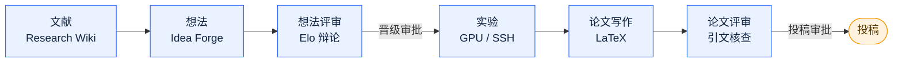

<p align="center">
  
</p>

<p align="center">
  <strong>自主、端到端的 AI 科研：从文献一路做到评审过的论文。</strong><br>
  由一个长时运行的智能体内核驱动，它自己规划、自己执行、自己验证，把每一项任务都变成可恢复、可审计、由人工把关的运行。
</p>

<p align="center">
  
  <a href="http://101.37.174.109:8080"></a>
  <a href="https://github.com/ZJU-REAL/Polaris/releases/latest"></a>
  <a href="LICENSE"></a>
  
  <a href="docs/assets/wechat-group-qr.jpg"></a>
</p>

<p align="center">
  <a href="README.md">English</a> · <strong>简体中文</strong>
</p>

<p align="center">
  
</p>

---

Polaris 把完整的科研生命周期做成一个 Web 应用：文献调研、想法生成、想法评审、在真实 GPU
服务器上做实验、LaTeX 论文写作，以及论文评审。它是为一个研究团队设计的，具备多用户、RBAC
和邀请码注册；并且把每一项长任务都当作一次 **Voyage**——一次被持久化、可恢复、由人工把关的
智能体运行，可以横跨数小时甚至数天而不丢状态（界面上就叫「任务」)。

> [!NOTE]
> Polaris 不是套壳聊天机器人。重活（抓取、解析、去重、指标解析、引文匹配）都是确定性代码，
> 大模型只留给需要判断的地方：打分、综合、起草和评审。这样的分工让每次运行都更便宜、可复现、
> 可审计。

## 演示

一段 2 分钟的平台导览：六阶段流水线、Voyage 智能体内核、一次真实的实验运行，以及 PolarisBuddy。

https://github.com/user-attachments/assets/388972c1-7ffa-45f2-94c4-07f388379ba2

### 在线试用

有一个跑在真实实例上的访客账号可以随便逛：在 <http://101.37.174.109:8080> 用用户名 `guest`、
密码 `zjuguest123` 登录。

**该账号仅用于演示：它是只读的，且不能调用任何模型。** 它能走到每一个页面，包括管理端视图，
但它做的任何事都不会改变状态——新建、编辑、删除和上传一律被拒绝，也不会触发任何 LLM 调用，
无论来自对话、编译还是助手。实验室成员的详细信息和注册码同样对它隐藏。它的作用是展示平台长
什么样，而不是在上面干活。

## 科研流水线

Polaris 把科研建模成六个阶段。每个阶段都产出可留存的产物供下一阶段消费，而每一次交接都可以
停下来等人工审批。



| 阶段 | Polaris 实际做的事 |
| --- | --- |
| **文献** | Research Wiki 从 OpenAlex、Semantic Scholar 和 arXiv 摄入论文。冷启动时以锚点论文为起点滚雪球式扩展引用网络，按**方向库**的收录配置（方向陈述、目标、范围与排除项，由一场结构化 AI 访谈写成）打分筛选相关性，再抽取全文（PyMuPDF）并编译成互相链接的 wiki 页面（TL;DR、方法、可复用的点子、概念反向链接）。**一篇论文只有一份解读，全平台共享**:编译时不带任何库的方向陈述或 rubric，所以同一篇论文不会因为你从哪儿点进去而读到不同内容；一个概念要有两篇论文引用才会被提升为正式概念。arXiv 新论文统一从每日新论文流进来，它是各文献库同步的唯一入口；支持带水位线断点续传的增量同步、pgvector 语义检索、研究摘要，以及 Obsidian 库同步。 |
| **想法** | Idea Forge 在知识库上做多信号缺口分析（概念共现的空洞、从论文中抽取的局限、趋势速度、综述空白）,以此驱动带检索规划的想法生成。想法会在四个维度上打分（新颖性、可行性、可操作性、影响力）,做语义去重，汇入候选池。随后一个深度 Research Proposal 构建器用「规划—执行—验证」循环把胜出的想法夯实。 |
| **想法评审** | 可配置人设的评审智能体两两辩论；由一个裁判产出 Elo 锦标赛排名。实验室成员可通过 WebSocket 实时加入讨论，他们的意见会作为一等输入进入智能体上下文。 |
| **实验** | Experiment Lab 使用按用户隔离、经 Fernet 加密的 SSH 凭据连接实验室的 GPU 服务器。一次实验 Voyage 会先做摸底提问，然后规划研究方案、通过算力预算校验、编写代码、跑冒烟测试、启动运行并流式输出日志与实时指标曲线，接着自动迭代：解析指标、反思，再决定改进、调试还是停止——修复失败靠的是**时间**预算，而不是固定的重试次数。它还有一份跨步骤读写的文件式记忆；真卡住时它会**向你提问**,而不是直接失败。控制台为每次运行提供任务图和一个可以边跑边对话的终端。图表会被生成并交由 VLM 检查。 |
| **论文写作** | Paper Writer 打开一个多文件 LaTeX 项目（NeurIPS、ICLR、ACL 模板）,配 CodeMirror 6 编辑器、实时协同编辑（CRDT）,以及服务端 tectonic 编译出的实时 PDF 预览。智能体逐节起草，但实验数字只能来自真实的 `ExperimentRun` 指标，引文也必须能对应到真实的知识库条目。一键刷新参考文献，并把 bibliography 接进主 TeX 文件。 |
| **论文评审** | 逐条引文核查（存在性：精确、轻微偏差或伪造；支撑度：支撑、部分支撑或不支撑）,外加把每一个数字与实验记录做确定性事实核对，然后由多视角的顶会评审智能体给出意见并汇总成 meta-review。只要出现一条伪造引文，就直接判为不通过。 |

## Voyage 智能体内核

科研任务天然就是长时任务：一次冷启动的文献回填要几个小时，一次实验要跑好几天。Polaris 的核心
抽象是：每一个复杂任务都是一次 Voyage——由一个被持久化的三段式循环驱动的、可恢复、可审计的运行。

| 组件 | 职责 |
| --- | --- |
| **Navigator（领航员）** | 规划。把目标拆解成带子目标、依赖和预算的步骤计划。在循环模式下，它会随着证据到来增量地修改计划，而不是推倒重来。 |
| **Helm（舵手）** | 执行。执行单个步骤（LLM 调用、工具调用、SSH 远程操作、文献 API 查询）并返回一条观测。 |
| **Sextant（六分仪）** | 自验证。按结构化的验收标准检查每一步（退出码、产物是否存在、schema 是否合法、指标阈值、数量、LLM 量规）。确定性检查先跑；失败会把诊断信息回喂给 Navigator，反复失败则转交人工处理。 |

> [!IMPORTANT]
> 一次 Voyage 背后是一个持久化状态机（`planning -> executing -> verifying -> ...`）。如果 worker
> 在运行中途崩溃，Voyage 会在健康检查后从上一个检查点继续。预算挂在这次运行上，超出即自动暂停；
> 每一份计划、每一个动作、每一条判定都会被保留，并可在界面上回放。

不是每个任务都需要完整的认知循环。一个共享的 **Runtime** 外壳（状态机、检查点、人工审批、预算、
取消、事件流）服务于所有任务类型，而 **Brain**(完整的「规划—执行—验证」循环）只在实验这类
开放式任务上启用。可预测的流水线（wiki 编译、想法评审、论文起草）跑固定模板，而不是被过度编排。

## 核心特性

- **Research Wiki,「编译，而非检索」。** 由大模型先把论文读完并编译成一个持久、互链的知识库，
  而不是在查询时才做即时 RAG。一篇论文一份解读，全平台共享。支持研究摘要，以及带
  `[[wikilinks]]` 和 frontmatter 的 Obsidian 库同步。
- **一个内容池，四种集合。** 每篇论文只存一份；方向库、课题书架、个人库和每日新论文流都是长在
  这个池子上的成员关系层。文献库已与课题解耦（多对多）,自己持有收录配置，并配有治理机制：
  策展人、月度预算、重复合并、用户建库 + 管理员审批，以及一个不会污染搜索结果的回收站。
- **每日 arXiv 新论文流。** 全实验室共享的每日新论文，可点赞，也可一键收藏进任何你有写权限的
  文献库。它同时是 arXiv 的唯一入口：各文献库从这个池子同步，而不是自己去查 arXiv,抓取时刻由
  管理员配置。
- **Idea Forge。** 信号驱动的缺口分析、四维打分、语义去重，以及一个会对照本地文献库和外部来源
  二次核查新颖性的深度 Research Proposal 构建器。
- **多智能体 + 人类评审。** 人设化的评审智能体辩论出 Elo 排名；人可以实时加入，其意见被注入
  智能体上下文，而不是事后再拼接上去。
- **通过 SSH 的 Experiment Lab。** 智能体在真实 GPU 服务器上写代码、跑代码、按指标迭代、收集
  日志和图表；远程写操作需要放行，配有命令允许/拒绝清单、完整审计，以及三重预算上限（总量、
  单次运行、并发）。每次运行都有跨步骤的文件式记忆，在时间预算内自我修复，卡住时会**停下来
  向你提问**而不是直接死掉；它的控制台提供任务图和一个可以边跑边对话的终端。
- **Paper Writer。** 在线多文件 LaTeX,支持 CRDT 协同编辑和服务端 tectonic 编译；智能体起草被
  约束在真实指标和真实引文上，另有一键刷新参考文献并接入主 TeX 文件。
- **带引文核查的论文评审。** 每一条引文的存在性与支撑度都会对照本地文献库、Semantic Scholar 和
  OpenAlex 核查；所有数字都与实验记录做事实核对。
- **PolarisBuddy,应用内助手。** 一个跟着你逛遍每个页面的全局伙伴：在同一套只读工具层之上，跑
  Claude Code 式的多轮工具循环（经 SSE 流式输出，带工具卡片和内联图表）,提供 `chat`、`plan`
  (只调研、先给方案再动手)和 `goal`(朝一个目标持续循环)三种模式。它和 Voyage 用同一套
  Navigator / Helm / Sextant 拆分，所以每一步是被验证过的而不只是被生成出来的，还能把活交给
  子智能体。它的问候语由真实的 SQL 计数拼出来而不是模型生成，它能搜索你可见的每一个文献库，
  并携带页面上下文和按用户持久化的记忆。账号若无权调用模型，它就不启用。
- **两层技能系统。** 智能体行为以数据而非代码的形式打包。*Voyage 技能*是可版本化、可组合的
  `guidance`、`rubric`、`persona` 和 `workflow` 包，在具名位置注入智能体提示词，全局启用，并配有
  「发布—审批—安装—评分」的市场；每次 Voyage 都会对其用到的技能做快照以保证可复现。*Agent 技能*
  则采用 SKILL.md 的形状和三级渐进披露——目录里每个技能只占一行描述，正文由 `skill_load` 作为
  工具结果取回，附件按需读取——由模型自己决定加载什么，同时保住提示词前缀的缓存。
- **MCP 工具层。** 一个统一的只读工具注册表（文献、知识、课题状态、稿件、外部搜索）,既在内部
  提供给智能体循环，也对外暴露为 **MCP server**(Streamable HTTP 和 stdio）,供 Claude Code、
  Codex 和 Cursor 使用，并带自检和 try-it 演练场。按课题隔离，且严格只读。
- **处处实时。** SSE 用于智能体流式输出和 Voyage 进度；WebSocket 用于评审讨论、审批通知、实验
  日志跟踪和协同编辑。
- **多用户与 RBAC。** JWT 鉴权（fastapi-users）、邀请码注册、基于角色的访问控制，以及按调用记录
  的 token/成本核算，可归因到用户、课题和 voyage。文献库和论文的浏览量会被统计成 7 天热榜，
  让实验室看到大家真正在读什么。
- **LLM 抽象与模型路由。** 所有模型调用都走同一层；一张存在数据库里的路由表把每个科研阶段映射到
  具体的提供商、模型和推理强度档位（打分用便宜模型，辩论和起草用强模型）。管理员设定全局路由，
  用户可以覆盖自己的。内置的 fake provider 在生产环境被结构性禁用——就算把开关设错也打不开。

## 技术栈

| 层 | 技术 |
| --- | --- |
| 前端 | React 18 + TypeScript 5 + Vite 5,所有服务端状态走 TanStack Query,CodeMirror 6、Yjs（CRDT）、react-pdf、KaTeX |
| 桌面端 | Electron 外壳（macOS / Windows / Linux）,通过 `app://` 协议复用 Web 产物；所有重状态仍留在远程服务器 |
| 后端 | FastAPI（全异步）+ SQLAlchemy 2 + Alembic + fastapi-users（JWT） |
| 任务队列 | ARQ（Redis 作为 broker）;每个长任务都跑在请求线程之外 |
| 数据 | PostgreSQL 16 + pgvector（向量空间按模型隔离，不同模型的向量绝不混用）,以及 Redis 7 |
| 远程执行 | 用 asyncssh 连接 GPU 服务器；SSH 密钥用 Fernet 静态加密 |
| LaTeX | 服务端 tectonic,带一个缓存的宏包卷 |
| LLM | 多提供商抽象（OpenAI 兼容与 Anthropic）,配数据库模型路由表 |
| 部署 | Docker Compose（postgres、redis、api、worker、frontend） |

## 桌面客户端

Polaris 提供 macOS、Windows 和 Linux 桌面应用。**安装包请到
[Releases](https://github.com/ZJU-REAL/Polaris/releases/latest) 下载**——`.dmg` / `.zip`(macOS,
universal)、`.exe` / 便携版 `.zip`(Windows)、`.AppImage` / `.deb`(Linux),由 CI 在每个 `v*`
tag 上构建。应用会检查更新，能不重启就直接应用。

这些构建**既未签名也未公证**,所以每个平台都要先告诉系统一次它是安全的：macOS 执行
`xattr -dr com.apple.quarantine /Applications/Polaris.app`(或右键 → 打开）;Windows 在
SmartScreen 上选「更多信息 → 仍要运行」;Linux 的 AppImage 需要 `libnss3 libgtk-3-0 libasound2`,
在 Ubuntu 24.04+ 的 AppArmor 限制下要加 `--no-sandbox`。首次启动时应用会让你填实验室的 Polaris
服务器地址，并用 `/api/health` 校验；服务端必须放行桌面端来源，因为页面由 `app://polaris` 提供，
每个请求都是跨域的。

Electron 外壳（`src/desktop/`）是「外壳 + 一个小的本地进程」,不是离线版：Postgres、Redis、worker
以及所有 LLM 调用都留在远程服务器上，渲染进程直接与之通信。想自己构建：

```bash
make desktop-deps           # 安装外壳的依赖（只需一次）
make desktop-dev            # 构建前端并启动外壳（app:// 协议）
make desktop-dist           # 为当前平台打一个未签名的安装包
```

进程模型、IPC 约定和打包注意事项见 [docs/desktop.md](docs/desktop.md)。

## 快速开始

只有 Codex 订阅、没有 LLM API Key？可使用 [Codex 订阅个人部署](docs/zh/codex-deployment.md)，嵌入和重排仍可使用独立 API。


> [!TIP]
> 无论开发还是生产，都推荐用 Docker Compose 跑 Polaris。它只需要装 Docker 和 Docker Compose,
> 本地不需要 Python、Node 或数据库。生产部署见
> [docs/deployment.md](docs/deployment.md)。

```bash
cp .env.example .env        # 填入各提供商的密钥和 secret
make dev                    # 通过 docker compose 起全栈，支持热重载
```

- 前端：<http://localhost:5173>
- 后端 API 文档：<http://localhost:8000/docs>

不用 Docker 的本地开发（会回退到 SQLite）:

```bash
make backend-dev            # venv + uvicorn，监听 :8000
make frontend-dev           # npm install + vite dev，监听 :5173
```

常用命令：

```bash
make migrate                # alembic upgrade head
make test                   # 后端 pytest + 前端构建
make lint                   # ruff check + tsc --noEmit
```

## Docker 部署

直接用 Docker Hub 上预构建的镜像部署（`tricktreat/polaris-{api,worker,frontend}`,由 CI 在每个
`v*` tag 上发布）——本地无需构建：

```bash
cp .env.example .env        # 设置 POLARIS_ENV=prod、POLARIS_IMAGE_TAG、各类 secret，以及一个 LLM key
docker compose --env-file .env -f docker/docker-compose.yml pull
docker compose --env-file .env -f docker/docker-compose.yml up -d
docker compose -f docker/docker-compose.yml exec api alembic upgrade head   # 首次运行必须执行
```

前端在 `http://<host>:8080` 提供服务。`worker` 容器是必需的（所有长任务都由它执行）,首次运行的
迁移也是必须的（Postgres 的表不会自动创建）。记得带上 `--env-file .env`,这样 Compose 才能从仓库
根目录的 `.env` 里读到 `POLARIS_IMAGE_TAG`(默认 `latest`)/ `POLARIS_IMAGE_PREFIX`(默认
`tricktreat`)。

如果你想改为本地构建，或需要绑定挂载、备份和受限网络的说明，见
[docs/deployment.md](docs/deployment.md)。

## 文档

完整文档在 [docs/](docs/)(英文）:

- [Getting started](docs/getting-started.md):安装、配置并运行 Polaris
- [Architecture](docs/architecture.md):系统设计与 Voyage 智能体内核
- [Concepts](docs/concepts.md):科研流水线、Voyage、技能与 MCP 工具
- [Deployment](docs/deployment.md):用 Docker Compose 做生产部署
- [Desktop](docs/desktop.md):Electron 外壳——进程模型、IPC 约定与打包
- [Configuration](docs/configuration.md):环境变量与各项设置
- [Development](docs/development.md):本地开发流程与约定

## 仓库结构

```text
src/
  backend/       FastAPI 应用（包名：app）与 ARQ worker（包名：worker）
    app/
      api/         轻薄的路由层
      services/    业务逻辑（摄入、wiki、想法、评审、实验、稿件……）
      models/      SQLAlchemy 模型
      agents/voyage/  Voyage 引擎（navigator、helm、sextant、工具循环、各领域动作）
      core/        配置、数据库、队列（ARQ）、事件（SSE）、llm/ 抽象层
      tools/, mcp/ 只读工具注册表与对外的 MCP server
  frontend/      React + Vite（src/features/ 下每个产品模块一个目录）
  desktop/       包装 Web 产物的 Electron 外壳（macOS / Windows / Linux）
docker/          Dockerfile 与 compose（base、dev override、prod overlay）
docs/            英文项目文档
```

## 设计原则

- **严格分层。** 轻薄的路由调用 service;service 承载业务逻辑，且从不导入 Web 框架；模型层在最底下。
- **确定性与判断性分离。** 确定性的活（抓取、解析、去重）交给普通代码或 worker 任务；只有需要
  判断的地方才走大模型。
- **单一 LLM 边界。** 所有模型调用都经过同一个抽象层，模型的选择来自数据库里的路由表，而不是硬编码。

完整设计见 [docs/architecture.md](docs/architecture.md)。

## 参与贡献

见 [CONTRIBUTING.md](CONTRIBUTING.md)。简而言之：一个功能一个分支一个 PR,从最新的 `origin/main`
切出，使用英文的 conventional commit 信息，`main` 保持为 `origin/main` 的只读快进镜像。

## 许可证

基于 Apache License 2.0 授权。完整条款见 [LICENSE](LICENSE)。
